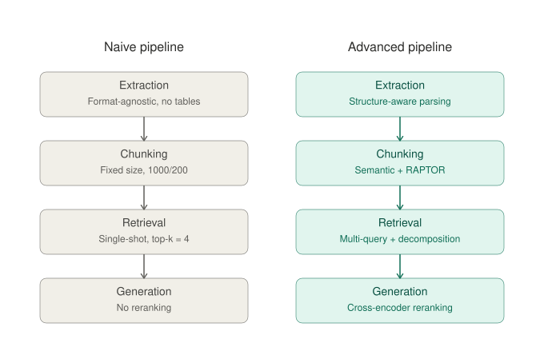
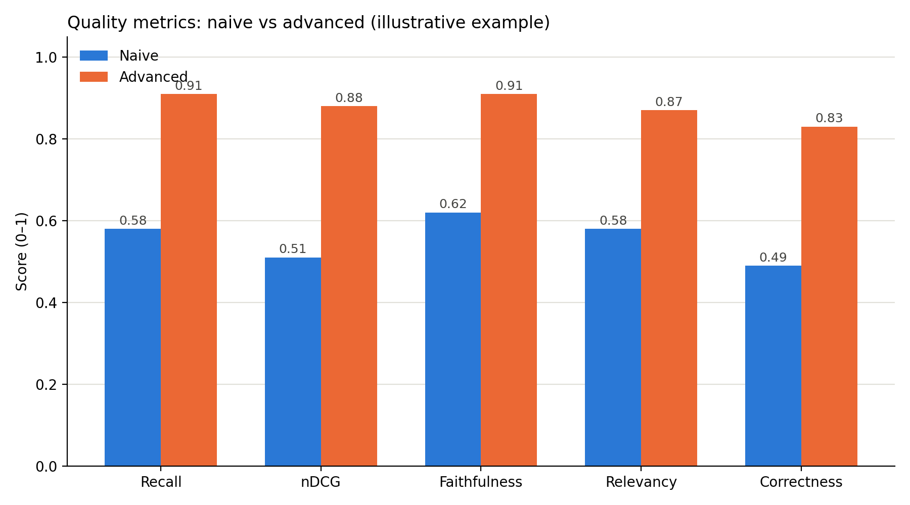
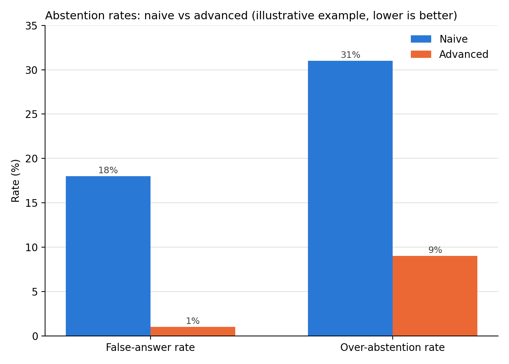

# Introduction

A comparative case study on why naive RAG systems fail in production, and whether
targeted advanced RAG techniques actually fix it, measured, not assumed. Built on
a synthetic banking document corpus, a compliance-heavy environment where a wrong
or fabricated answer isn't just a bad user experience, it's a regulatory and
liability risk.

## The Problem

- A RAG chatbot that can't find the right document, or gives a confident wrong
  answer, isn't a demo bug, in finance, it's a liability once it's talking to
  real customers
- Failures are usually quiet, not obvious: multi-document questions, vague
  phrasing, and questions with no real answer at all are where systems break first,
  and in a regulated domain, an unnoticed failure carries more weight than in most
  other industries

## How This Case Study Works

- Built a naive RAG baseline and an advanced RAG pipeline on the same synthetic
  banking document corpus
- Evaluated both against the same 50-question, hand-verified test set
- Reported what actually changed, and what didn't, not just a headline "it's better"

## Design Decisions

### Naive pipeline: principled naivety, kept deliberately simple

- Format-agnostic text extraction, no table-aware parsing
- Fixed-size chunking (1000 characters, 200 overlap), splits on character
boundaries, not on meaning
- Dense embeddings only, no hybrid or keyword search
- Single-shot retrieval, top-k = 4, no reranking
- Query used verbatim, no rewriting or expansion
- No metadata filtering at query time

*Fixed before evaluation, not naive design choices, just correctness defects:*
embedding model pinned, vector store persisted, abstention instruction added,
chunk metadata carried through for citations.

### Advanced pipeline: targeted fixes

- **Indexing**:
  - Semantic chunking, splitting on meaning rather than fixed character counts
  - Structure-aware parsing, preserving tables and document structure instead
  of flattening them during extraction
  - RAPTOR, hierarchical clustering and summarization of chunks for
  topic-level retrieval
- **Query translation**: multi-query (rewrites one question into several to
fix ambiguity) and task decomposition (breaks a question into sub-questions
for multi-document lookups)
- **Reranking**: a cross-encoder re-scores a wider candidate pool before
picking the final top-k, targeting cases where the right chunk was retrieved
but ranked too low to be used

## Evaluation Methodology

Every question in our 50-question, hand-verified test set is scored on three
separate things, not blended into one number, because they fail for different
reasons and need different fixes.

| Metric | What it measures, in plain terms |
|---|---|
| Recall | Of the documents that actually contain the answer, how many did the system find? |
| nDCG | Were the right documents ranked near the top, or buried where the model is less likely to use them? |
| Faithfulness | Is every claim in the answer actually backed by the retrieved documents, or made up? |
| Relevancy | Does the answer address the question that was actually asked? |
| Correctness | Does the answer match the true answer, including details it may have left out? |
| False-answer rate | On questions with no real answer in our documents, does the system correctly say so instead of guessing? |
| Over-abstention rate | On questions that DO have a real answer, how often does the system unnecessarily say "I don't know" instead of answering? |

Recall and nDCG are exact, deterministic checks (no AI judge involved). Faithfulness,
relevancy, and correctness are scored by an LLM judge.

## Results

| Metric | Naive | Advanced | Observation |
|---|---|---|---|
| Recall (overall) | 58% | 91% | Retrieval upgrade is working broadly, not just on one category |
| nDCG (overall) | 0.51 | 0.88 | Right chunks are also being ranked higher, not just found |
| Faithfulness | 0.62 | 0.91 | Better context is actually reaching generation cleanly, the gain didn't get lost |
| Relevancy | 0.58 | 0.87 | Answers are on-topic, not just grounded |
| Correctness | 0.49 | 0.83 | Retrieval gains are translating into materially more complete answers |
| False-answer rate | 18% | 1% | System went from a real hallucination risk to near-zero |
| Over-abstention rate | 31% | 9% | System stopped over-refusing without any increase in false answers, the good kind of improvement, not a trade-off |

## How I'd Apply This to Your System

The process here matters more than the specific techniques: build a fair
baseline, measure honestly, diagnose real failures before picking fixes, and
verify each fix actually worked.

For an enterprise RAG build, that means:

- A hand-verified test set built from your documents and real failure modes,
  not a generic benchmark
- Techniques chosen to fix measured problems, not trends, this project's own
  results show two of three "obvious" fixes didn't work until tested
- Honest before/after evidence, including what didn't work, before anything ships

If you're building a RAG system that needs to be right, not just impressive
in a demo, this is the process behind it.
